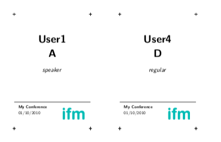

# badgeR

This is a package for badge creation for various (not only R) conferences.
Originally created for satRday Cardiff 2019 conference.

# Installation

From github:

```
devtools::install_github("CaRdiffR/badgeR")
```

# How to use it?

Once you have your participants data in a vaild format, eg. `data.frame` with columns:

- `first` for a first name
- `second` for a second name
- `role` for a role at the event, eg. "speaker"

Here's an example of how should it look:

```r
badges_data <- data.frame(first = c("Jon", "Tyrion"),
                          second = c("Snow", "Lanister"),
                          role = c("organiser", "speaker"))
```

It is as simple as this:

```r
create_badges(badges_data, output_file_name = "my_conference_badges.pdf")
```

For more advanced feature just read the docs.

```r
?create_badges
```

### Gallery

Example of badge created with this tool:


